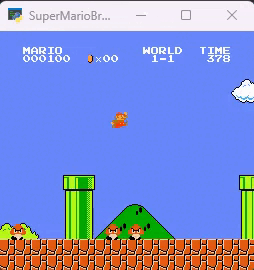

# mario-main
Introduction:

This is a homework work that uses the DQN algorithm to train and implement the Super Mario game.
This work is based on the work in the official Pytorch reinforcement learning tutorial.
Below is the result of my own training for 800 epochs.

Instructions:

(1) Clone git

(2) Installation requirements
pip install -r requirements.txt

Or install all libraries manually:
ale-py               0.9.0
cloudpickle          3.0.0
colorama             0.4.6
contourpy            1.1.1
cycler               0.12.1
filelock             3.14.0
fonttools            4.52.4
fsspec               2024.5.0
gym                  0.23.1
gym-notices          0.0.8
gym-super-mario-bros 7.2.3
imageio              2.34.1
importlib_metadata   7.1.0
importlib_resources  6.4.0
intel-openmp         2021.4.0
Jinja2               3.1.4
kiwisolver           1.4.5
lazy_loader          0.4
MarkupSafe           2.1.5
matplotlib           3.7.5
mkl                  2021.4.0
mpmath               1.3.0
nes_py               8.2.1
networkx             3.1
numpy                1.24.4
opencv-python        4.9.0.80
packaging            24.0
pillow               10.3.0
pip                  24.0
pyglet               1.5.21
pyparsing            3.1.2
python-dateutil      2.9.0.post0
PyWavelets           1.4.1
scikit-image         0.21.0
scipy                1.10.1
setuptools           69.5.1
six                  1.16.0
sympy                1.12
tbb                  2021.12.0
tifffile             2023.7.10
torch                2.3.0+cu118
torchaudio           2.3.0+cu118
torchvision          0.18.0+cu118
tqdm                 4.66.4
typing_extensions    4.12.0
wheel                0.43.0
zipp                 3.19.0

(3) Code running

Use main.py for training.
python main.py
episodes represents the number of training times, which can be set to your own number.

Use replay.py for testing.
python replay.py

